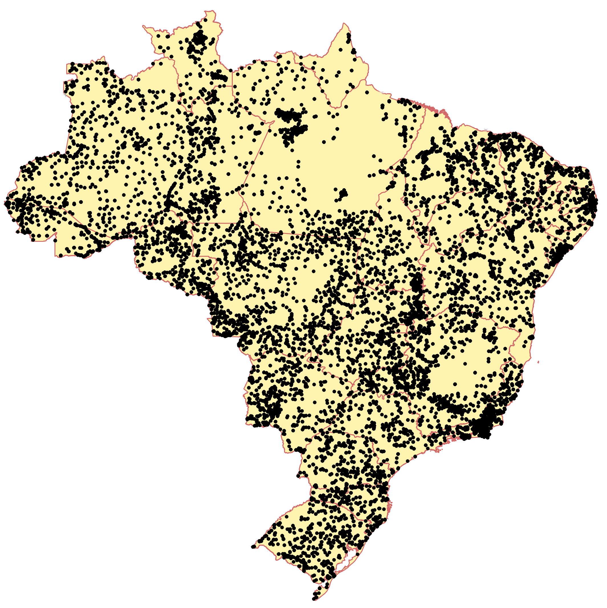

<!-- Opções para livro em pdf -->

\clearpage
\tableofcontents

<!-- \clearpage -->
<!-- \listoffigures -->

\clearpage
\listoftables

# Introdução

Uma parte importante do empreendimento científico consiste em limpar e estruturar os dados que produzimos
[@Sestoft2011; @Wickham2014]. Se decidimos usar dados produzidos por outros, então a padronização e 
harmonização dos dados também se tornam necessárias [@BatjesEtAl2017]. Em todo caso, a organização adequada 
dos dados é crucial para a execução de análises e modelagem dos dados. Infelizmente, essa tarefa geralmente 
leva mais tempo do que gostaríamos, às vezes mais da metade do nosso tempo de trabalho [@CrowdFlower2017].
Talvez isso seja ainda pior para nós, cientistas do solo, haja vista nossa conhecimento geralmente limitado 
sobre tecnologia da informação e a falta generalizada de padrões. Felizmente, o número de perguntas sobre como
organizar os dados do solo tende a diminuir à medida que ganhamos experiência. Mas a questão de se organizamos
os dados do solo de uma maneira razoável, que pode ser verdadeiramente compreendida e efetivamente reutilizada 
por outros cientistas do solo -- e nós mesmos no futuro -- permanece sem resposta.

A ciência do solo já produziu grandes quantidades de dados. Ainda assim, as práticas que costumamos adotar para
armazenar e compartilhar dados do solo são sub-ótimas. Sub-ótimas porque elas limitam a 'descobertabilidade' 
(do inglês, *discoverability*) dos dados do solo, isto é, a habilidade que um determinado conjunto de dados do
solo tem de ser descoberto por outra pessoas. No Brasil, muitos conjunto de dados são difíceis de serem 
descobertos porque estão disponíveis somente em documentos impressos ou (mal) escanerizados. Quando os 
conjuntos de dados do solo são altamente 'descobríveis', talvez eles precisem ser digitalizados ou podem estar 
contidos em mídias protegidas por senha ou em bancos de dados que são difíceis de usar e/ou dependem de 
programas de computador proprietários. Quando não existem barreiras tecnológicas, então os conjuntos de dados 
do solo podem conter dados de apenas algumas variáveis do solo ou profundidades do solo selecionadas do 
conjunto original de dados do solo, ou apenas uma versão agregada dos dados do solo está disponível. E quando 
um conjunto de dados do solo está totalmente disponível, os metadados podem estar incompletos ou ausentes. 
Esses aspectos, juntamente com uma pobre organização dos dados do solo, limitam a 'reusabilidade' (do inglês,
*reusability*) dos dados do solo, isto é, a habilidade que um determinado conjunto de dados do solo tem de ser
usado novamente por seu produtor e/ou outra pessoa. Por fim, uma limitada descobertabilidade e reusabilidade 
dos dados do solo dificulta a observância de um dos princípios básicos do método científico, ou seja, a
reprodutibilidade da pesquisa.

O cenário aqui ilustrado não se limita à ciência do solo brasileira ou à ciência do solo ou à própria atividade
científica. Na verdade, a sociedade pós-moderna entendeu que um volume considerável de dados produzidos pela
humanidade está sendo subutilizado ou está sob o risco de se perder para sempre [@HansonEtAl2011; 
@VinesEtAl2014]. Para ajudar a mudar esse cenário, muitos governos concordaram em desenvolver políticas para 
incentivar o gerenciamento aberto de dados produzidos através de financiamento público, incluindo dados 
científicos. O Brasil foi um dos primeiros países a assinar tal acordo, a Parceria de Governo Aberto
([OGP](https://www.opengovpartnership.org/)), e criar legislação específica para determinar quais são as 
melhores práticas de gerenciamento de dados que devem ser adotadas no Brasil -- veja
[Decreto No. 8777 de 2016](http://www.planalto.gov.br/ccivil_03/_Ato2015-2018/2016/Decreto/D8777.htm). 
Infelizmente, devido a razões culturais -- falta de tradição, medo de perder direitos -- e operacionais -- 
falta de financiamento, infra-estrutura e padrões --, a adesão das instituições públicas à Política Brasileira 
de Dados Abertos tem sido pequena, especialmente no caso dos detentores de dados científicos.

Em resumo, as estratégias empregadas para organizar, armazenar e compartilhar dados do solo estão em desacordo 
com as demandas atuais da sociedade pós-moderna porque limitam a descoberta e reutilização dos dados do solo e,
portanto, impedem a reprodutibilidade da pesquisa do solo. Olhando para o caso específico do Brasil, no curto 
prazo, isso representa um uso ineficiente dos já escassos investimentos feitos na ciência do solo. A longo 
prazo, isso detém o avanço do conhecimento do solo, as consequências refletindo no modo como os recursos 
naturais serão geridos nas próximas décadas e pelas gerações futuras.

## Experiências recentes

Historicamente, a maneira mais comum de obtenção de dados do solo é a sua amostragem no campo. Mas como o uso 
das tecnologias da informação permite a manipulação de um grande volume de dados, especialmente necessários 
em aplicações pedométricas em larga escala, surge uma nova e importante fonte de dados do solo. Trata-se dos 
dados coletados nas muitas décadas passadas, geralmente armazenados utilizando tecnologias obsoletas e 
estratégias ineficientes, algumas vezes sob risco de serem perdidos para sempre, os chamados dados legados, 
que, por definição, foram 'deixados para as próximas gerações'.

Muitos esforços já foram empreendidos no mundo todo para compilar, organizar e distribuir gratuitamente dados 
legados do solo, agregando a eles dados coletados mais recentemente (Tabela \@ref(tab:bases-de-dados)). Hoje, 
a maior plataforma global de 
distribuição de dados do solo é a WoSIS, criada e mantida pelo ISRIC. Via uso de técnicas modernas de 
aprendizado de máquina e mineração de dados para análise dos dados da WoSIS e sua correlação com os dados do
WorldGrids, o ISRIC produziu mapas globais de baixa resolução espacial de diversas características do solo, os quais estão disponíveis gratuitamente na plataforma SoilGrids (https://www.soilgrids.org).

```{r, echo=FALSE}
bd <- 
  c("Africa Soil Profiles Database", "Archivo Digital de Perfiles de Suelo de México", 
    "Sistema de Informação de Solos Brasileiros", "Sistema de Información de Suelos del INTA",
    "Soil and Landscape Grid of Australia", "USA National Cooperative Soil Survey", 
    "World Soil Information Service")
n <- c(18500, 10000, 9000, 3000, 280000, 50000, 100000)
e <- 
  c("http://africasoils.net/services/data/soil-databases", 
    "http://www.inegi.org.mx/geo/contenidos/recnat/edafologia/PerfilesSuelo.aspx",
    "https://www.bdsolos.cnptia.embrapa.br/consulta_publica.html", 
    "http://sisinta.inta.gob.ar", "http://www.clw.csiro.au/aclep/soilandlandscapegrid",
    "https://sdmdataaccess.nrcs.usda.gov", "http://www.isric.org/explore/wosis")
d <- data.frame('Base de dados' = bd, 'Número' = n, 'Endereço' = e)
pander(d, caption = "(\\#tab:bases-de-dados) Algumas bases de dados do solo no mundo e o número de observações do solo que contém. Número aproximado de observações reportado em 11 de maio de 2017 (a) no portal online da respectiva base de dados, (b) no portal online da WoSIS ou (c) na publicação onde o conjunto de dados foi usado.")
```

No Brasil, há certa dispersão de esforços na compilação, organização e distribuição de dados legados e 
recentes. Isso porque dois órgãos possuem essa mesma atribuição, mesmo que de maneira não exatamente formal, a 
Empresa Brasileira de Pesquisa Agropecuária (Embrapa) e o IBGE, fruto da sua ativa participação em grandes 
projetos de levantamento de dados e mapeamento do solo, especialmente o Projeto Radambrasil. Grosso modo, o 
IBGE dedica-se aos dados do Projeto Radambrasil, constantemente atualizando a classificação do solo, dados 
esses distribuídos em http://www.downloads.ibge.gov.br. Já a Embrapa dedica-se tanto aos dados do Projeto 
Radambrasil, como aos dados produzidos via seus outros projetos, inclusive os mais recentes, tendo construído 
o Sistema de Informação de Solos Brasileiros (SISB) para seu armazenamento e distribuição gratuita. Juntos, os 
dados sob salvaguarda do IBGE e da Embrapa somam cerca de 10 mil observações do solo (Figura 
\@ref(fig:pontos-brasil)).

```{r pontos-brasil, echo=FALSE, fig.cap="Localização das cerca de 10 mil observações do solo disponíveis para uso, gratuitamente, nas plataformas online da Embrapa e do IBGE."}

```

Também há diversos esforços particulares para compilar, organizar e distribuir gratuitamente dados legados e 
recentes do solo obtidos em projetos de universidades e instituições de pesquisa, ou mesmo para aprimorar os 
dados sob salvaguarda do IBGE e Embrapa. Esses esforços diferem quanto à abrangência territorial e nível de
participação da comunidade de pesquisadores. Uma das mais importantes iniciativas particulares consistiu na 
compilação de dados do Projeto Radambrasil por pesquisadores da Escola Superior de Agricultura "Luiz de 
Queiroz" (ESALQ, http://www.esalq.usp.br/gerd), que recuperaram as coordenadas espaciais de muitas observações 
do solo a partir de mapas impressos e descrições nos relatórios do Projeto Radambrasil. Recentemente, também na
ESALQ, foi iniciado o projeto de construção da Biblioteca Espectral de Solos do Brasil (BESB,
http://bibliotecaespectral.wixsite.com/esalq), que já teve contribuições de pesquisadores de 18 instituições e 
conta com acervo de dados espectrais de 20 mil amostras do solo.

## Um repositório livre para dados abertos do solo

O Repositório Brasileiro Livre para Dados Abertos do Solo (febr) está baseado no uso de ferramentas de software de código aberto e/ou software livre muito simples, mantendo os custos de implementação e manutenção consideravelmente baixos. Além disso, a filosofia do febr é usar uma estrutura de dados com a qual a maioria dos cientistas do solo trabalham em suas atividades cotidianas: planilhas. Isso torna muito fácil para os cientistas do solo entrar dados do solo no repositório porque o obstáculo demorado de ter que aprender um novo software e/ou estruturas de dados é completamente eliminado.

Além disso, usando uma instalação centralizada de armazenamento e compartilhamento de dados do solo, como o febr, os esforços duplicados de recuperação de dados do solo podem ser significativamente minimizados, permitindo que os recursos existentes sejam usados para maximizar a colaboração entre cientistas do solo. Isso foi visto nos fóruns de discussão permanentes, onde produtores e usuários de dados do solo compartilham suas experiências, criando assim um conhecimento livre e contínuo dos dados do solo. Na prática, esse conhecimento e colaboração já ajudaram a melhorar a qualidade dos dados legados do solo contidos no febr. Também permitiu a implementação de uma camada dedicada de ferramentas de software livre e de código aberto que abstraem dos produtores e usuários de dados do solo a complexidade das rotinas de padronização e harmonização de dados do solo. Como resultado, o tempo gasto em "massagem" de dados do solo é consideravelmente reduzido, permitindo aos cientistas do solo dedicar mais recursos ao que eles melhoram: análise de dados e modelagem.

Finalmente, o febr é otimizado para o gerenciamento de conjuntos de dados do solo em vez dos dados do solo. Isso significa que pode ser facilmente expandido para acomodar qualquer tipo de dados em qualquer variável do solo, independentemente do método usado para produzi-los ou sua unidade de medição ou alcance de valores ou qualquer outra característica. Ao ter os conjuntos de dados do solo como unidades de trabalho, o repositório reconhece que qualquer dado do solo tem seu valor, seja reconhecido ou não por um ou outro grupo de cientistas do solo, e que esse valor pode mudar no futuro. Só exige que um conjunto de dados do solo tenha seus próprios metadados abrangentes, o que possibilita conceber as dinâmicas de padronização e harmonização mencionadas acima, bem como a futura reutilização dos dados do solo sem a necessidade de entrar em contato com os autores do conjunto de dados do solo. Esta reutilização inclui, por exemplo, a alimentação de bancos de dados de solo especializados que exigem que os dados do solo cumpram requisitos muito específicos. Além disso, a estrutura orientada por conjuntos de dados garante que os autores dos conjuntos de dados do solo sejam devidamente reconhecidos e citados por outros, contribuindo assim para o aumento das medidas de impacto científico.

## Modelo de dados

Descobertabilidade e reusabilidade referem-se às duas primeirasl das Três Leis dos Dados Abertos definidas por
[David Eaves em 2009](https://eaves.ca/2009/11/29/three-laws-of-open-data-international-edition/). No âmbito da
Política Brasileira de Dados Abertos, garantir que um conjunto de dados possa ser encontrado requer o uso de
repositórios de dados e catálogos de metadados. O febr veio para suprir essa necessidade. Aqui nos limitamos a
apresentar um modelo de dados para garantir a reusabilidade dos dados do solo no Brasil.

A premissa básica do nosso modelo de dados é que, operacionalmente, qualquer observação do solo tem quatro 
dimensões espaço-temporais. As duas primeiras são as coordenadas espaciais horizontais *x* e *y*, referindo-se
a algum sistema de referência de coordenadas (SRC) padrão predeterminado. A terceira dimensão é representada 
por *t*, a coordenada temporal, o momento -- de acordo com um calendário padrão predeterminado e sistema de 
zoneamento temporal -- no qual observamos o solo. A quarta e a última dimensão são dadas pela coordenada 
vertical *d*, que na prática é a profundidade de observação medida de acordo com uma escala padrão 
predeterminada, por exemplo, metros.

Pode-se argumentar que armazenar dados com quatro dimensões (4D) requer modelos de dados muito complexos, ou 
seja, bancos de dados relacionais. No entanto, entendemos que a carga de trabalho de um cientista do solo já 
é muito pesada. Como tal, um modelo de dados deve ser o menos complexo possível e, a longo prazo, deve 
simplificar as tarefas relacionadas ao gerenciamento de dados. Outros poderiam dizer que um novo modelo de 
dados é desnecessário porque os dados do solo 4D podem ser facilmente acomodados em tabelas bidimensionais 
simples, tal como implementadas em software de escritório popular. Nós concordamos que as ferramentas de 
software da planilha eletrônica são o caminho a seguir -- como mostraremos na sequência. No entanto, as 
práticas atuais são sub-ótimas e, a longo prazo, tornam desnecessariamente difíceis as tarefas relacionadas ao
gerenciamento de dados.

No **febr**, os dados são armazenados em tabelas bidimensionais estruturadas usando planilhas eletrônicas padronizadas construídas a partir de experiências de iniciativas tanto locais como globais. São quatro as tabelas utilizadas, com nomes (`tabela_id`):

1. *dataset*, para os dados sobre o conjunto de dados,
2. *observacao*, para os dados das observações do solo,
3. *camada*, para os dados das camadas e horizontes, e
4. *metadado*, para os dados sobre os dados.

Uma descrição detalhada do propósito e conteúdo específico de cada uma dessas tabelas é apresentado nas 
sessões que seguem.

<!-- Nós acreditamos que o uso sustentável do solo para aplicações ambientais no Brasil exige o conhecimento da distribuição horizontal e vertical do conteúdo de ferro no solo. Por quê? Porque, em alguns locais, os óxidos de ferro podem perfazer até 80% da massa do solo! -->

<!-- Os óxidos de ferro são bem conhecidos por sua forte interação com a matéria orgânica do solo, influenciando assim a quantidade de carbono que o solo consegue armazenar de forma estável. Os óxidos de ferro também são bem conhecidos pela sua forte afinidade com íons fosfato, determinando assim a disponibilidade de fósforo para as plantas. A intrincada relação entre fósforo e matéria orgânica reforça a necessidade do conhecimento da variação tridimensional do teor de ferro do solo em todo o território brasileiro. Tal conhecimento poderia ajudar, por exemplo, na melhoria dos sistemas de classificação do solo, no desenvolvimento de sistemas avançados de recomendação que assegurem o uso mais eficiente de fertilizantes fosfatados, e na construção de políticas públicas de uso e ocupação do solo que respeitem as reais capacidades desse precioso e não-renovável bem natural. -->

<!-- Foi pensando na necessidade de impulsionar o avanço do conhecimento para o uso sustentável do solo brasileiro que decidimos desenvolver um projeto inovador. O objetivo: a construção colaborativa de um repositório de dados de ferro do solo com cobertura nacional que fosse público, gratuito e, sobretudo, fácil de usar e manter. -->


